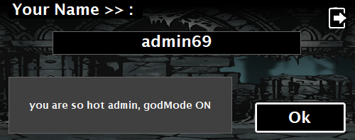

# suslJump

## School Programming Competition: Game

### **My project for the school game development competition in WinForms during my third year of high school.**

## About project:
- A 2D endless jumper game made in C# WinForms.
- Net5.0 framework used for this project.
- The game code is not well optimized due to the limited time available for the project and my insufficient knowledge at the time.

## Some gameplay gifs:

### Login screen (use "admin69" to infinite money and shields):

### Change keybinds in the settings:

### Your score is store locally so you can see the leaderboard:

### Shield in the shop to defend against eye monsters:

### Using shield in gameplay:

### Basic gameplay:

